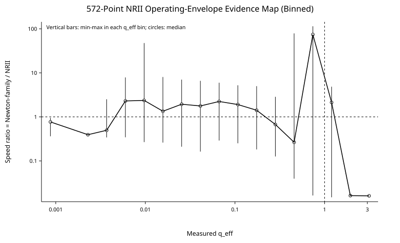
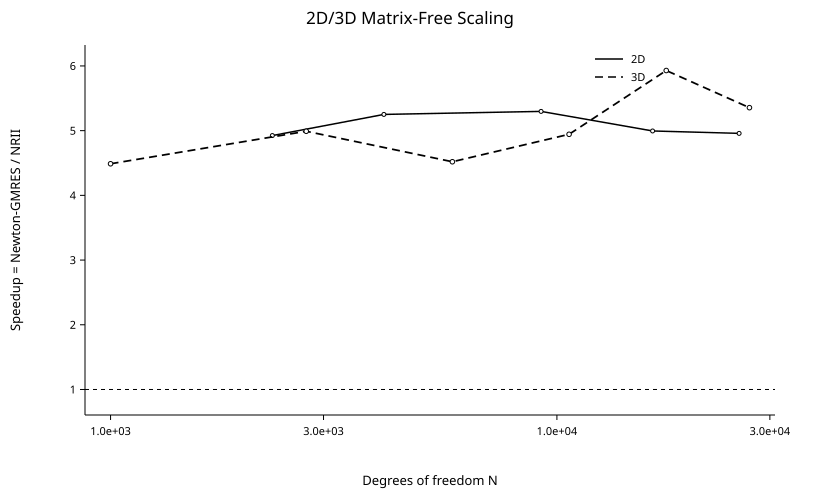
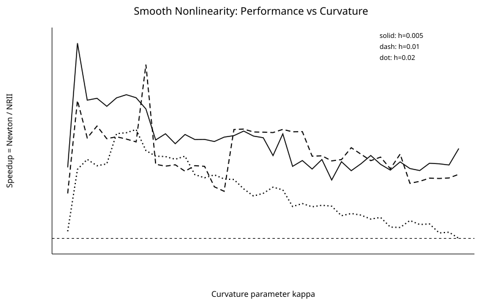
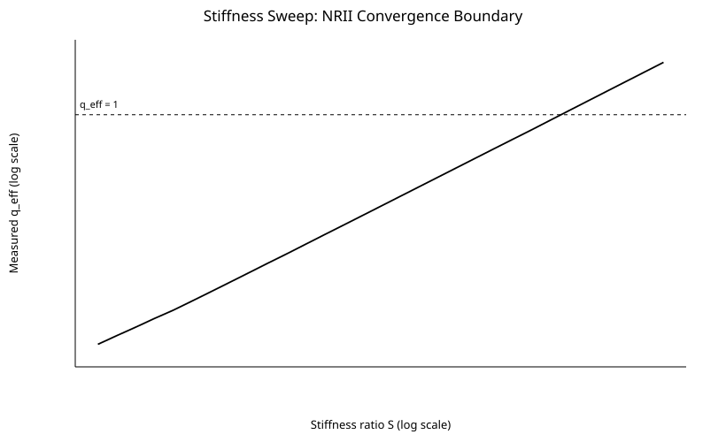
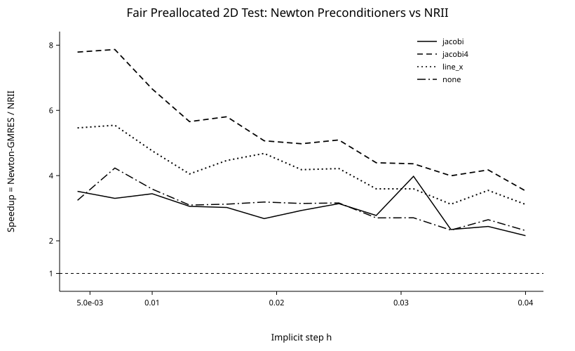
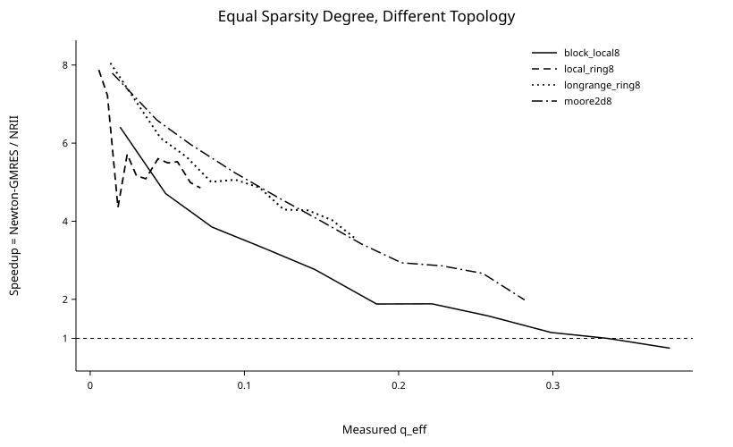

# NRII Operating Envelope: Controlled C Benchmarks Against Newton-Family Solvers

**Benchmark snapshot:** 2026-09-06  
**Implementation language:** C / C17-style kernels  
**Compiler used for the reported runs:** GCC 14.2.0, `-O3 -march=native`  
**Arithmetic:** FP64  
**Execution mode:** single-threaded CPU  
**Host reported by the benchmark environment:** AMD EPYC 9V74, Linux x86-64

## Abstract

This report characterizes the measured operating envelope of NRII (Non-Residual-Iterative Implicit) relative to Newton-family implicit solvers. The objective is not to establish universal dominance. The objective is to determine which mathematical and computational structures favor constructive coefficient propagation, which structures favor residual-correction methods, and where a relay between the two is justified.

A total of 572 measured parameter points are aggregated from controlled C microbenchmarks covering effective coefficient-tail ratio, problem size, sparsity degree, sparsity topology, smooth curvature, analytic nonlinearity family, stiffness, nonnormality and transient amplification, Newton preconditioning, and two- and three-dimensional matrix-free discretizations. Each comparison uses explicit residual checks. A speed ratio greater than one denotes lower measured runtime for NRII:

\[
S_T = \frac{T_{\mathrm{Newton-family}}}{T_{\mathrm{NRII}}}.
\]

The principal result is that NRII is not best characterized by nonlinearity strength alone. Its measured competitiveness is governed by two separate questions: whether its coefficient representation remains numerically well behaved, and how expensive the competing Newton linear solve is. Low or moderate coefficient-tail contraction, controlled transient amplification, and an expensive global Krylov solve form the most favorable region. Strong stiffness that drives the coefficient-tail ratio toward or beyond unity, or a Jacobian that can be solved cheaply by a direct method, favors Newton.

## 1. Solver model

For an implicit state relation

\[
F(U,h)=0,
\]

NRII constructs a local representation

\[
U(h)=\sum_{k=0}^{p} C_k h^k
\]

through coefficient propagation induced by the implicit relation. The comparison methods follow the conventional residual-correction route, for example

\[
J(U_k)\,\Delta U=-F(U_k),\qquad U_{k+1}=U_k+\Delta U,
\]

with either a direct linear solve or a matrix-free Krylov solve depending on the benchmark.

Two NRII diagnostics emerged as necessary during the parameter study.

### 1.1 Effective tail ratio

The measured effective tail ratio is estimated from the last generated terms,

\[
q_{\mathrm{eff}}
\approx
\operatorname{median}
\left(
\frac{\|C_{k+1}h^{k+1}\|}{\|C_kh^k\|}
\right).
\]

For a regular geometric tail, smaller values indicate faster coefficient decay. Values approaching unity correspond to slow convergence; values beyond unity indicate a loss of convergence for the unmodified power-series construction.

### 1.2 Transient coefficient amplification

A small final tail ratio is not sufficient in strongly nonnormal systems. The coefficient sequence can undergo substantial intermediate amplification before it decays. A practical diagnostic is

\[
\Gamma_{\mathrm{transient}}
=
\frac{\max_k \|C_kh^k\|}{\|C_0\|+\varepsilon}.
\]

Large values can consume floating-point accuracy even when the final measured tail ratio is small. The experiments therefore treat \(q_{\mathrm{eff}}\) and \(\Gamma_{\mathrm{transient}}\) as separate quantities.

## 2. Experimental design

The parameter study is composed of nine controlled benchmark groups.

| Benchmark axis | Measured points | Range or structure |
|---|---:|---|
| Effective tail ratio | 41 | continuous convergence-regime sweep |
| Size and sparsity degree | 140 | multiple sizes and nonzeros-per-row values |
| Smooth curvature | 123 | \(\kappa=0\ldots40\) at three implicit step sizes |
| Nonnormal pathology and sparsity | 45 | nonnormal chain factor and bandwidth |
| Stiffness | 31 | stiffness ratio \(S=1\ldots2000\) |
| Analytic nonlinearity family | 85 | quadratic, cubic, exponential, cosine, shifted tanh |
| Newton preconditioning | 52 | none, Jacobi, multi-sweep Jacobi, line preconditioner |
| 2D/3D scaling | 11 | matrix-free grid problems |
| Equal-degree sparsity topology | 44 | local, long-range, block-local, and 2D Moore-type connectivity |

All reported speed comparisons are paired with residual checks. Points that fail the NRII residual criterion or cross the measured \(q_{\mathrm{eff}}\ge 1\) boundary are not interpreted as valid NRII speed wins.

## 3. Global evidence map

The aggregate phase map shows that \(q_{\mathrm{eff}}\) is a strong NRII convergence coordinate but not a complete performance predictor. At the same approximate tail ratio, different problem structures can favor different solvers. The missing variable is predominantly the cost and topology of the Newton linear solve.

The 572 measured points were classified using a conservative engineering rule: NRII is preferred only when it is accurate and at least 15% faster; Newton is preferred when it is at least 15% faster; the intermediate band is assigned to relay; an NRII residual above \(10^{-8}\) or \(q_{\mathrm{eff}}\ge1\) is assigned to Newton or relay. The resulting counts are 365 NRII-favored points, 149 Newton-favored points, 42 boundary/relay points, and 16 Newton-or-relay points. These counts describe this controlled suite only and are not population statistics for arbitrary implicit problems.

## 4. Measured NRII advantages

### 4.1 Large matrix-free multidimensional problems

The most stable measured advantage occurs when Newton requires a global Krylov solve while NRII retains local coefficient propagation.

Across the tested 2D/3D scaling set, the measured runtime ratio is

\[
4.49 \le S_T \le 5.93.
\]

No tested size in this set reversed the ordering. This result supports the hypothesis that avoiding repeated global Krylov work can dominate the additional coefficient-propagation cost when the implicit representation remains well behaved.

### 4.2 Robustness to smooth curvature

Smooth curvature is not, by itself, a hard failure mechanism for NRII.

For the quadratic curvature study,

\[
\kappa=\left|\frac{\partial^2 G}{\partial u^2}\right|,
\]

the observed degradation is gradual. Increasing curvature primarily increases \(q_{\mathrm{eff}}\) and the required NRII order. At the smallest tested step size, NRII remains faster across the full \(\kappa=0\ldots40\) range. At the largest tested step size, the performance crossover occurs only after the tail ratio and required order have increased substantially.

The measured mechanism is therefore

\[
\kappa\uparrow
\;\Rightarrow\;
q_{\mathrm{eff}}\uparrow
\;\Rightarrow\;
p_{\mathrm{NRII}}\uparrow
\;\Rightarrow\;
T_{\mathrm{NRII}}\uparrow,
\]

rather than a direct failure caused by curvature alone.

### 4.3 Nonnormal systems that stall Newton-Krylov

Strongly nonnormal systems provide a distinct region in which the difficulty of the Newton linear algebra can separate from the difficulty of coefficient propagation. In the controlled upper-triangular/banded pathology, restarted GMRES reaches its iteration budget with relative residuals of order \(10^{-1}\) for part of the sweep, while NRII retains substantially smaller residuals until transient coefficient amplification becomes too large.

The largest measured runtime ratio in this deliberately pathological set is approximately 114. This number is not a general-purpose speedup claim; it demonstrates the existence of a solver-regime separation in which Krylov stagnation is severe while the constructive propagation remains usable.

### 4.4 Wider local coupling

In the size/sparsity sweep, increasing the local coupling width generally increases the relative cost of the Newton linear solve faster than the relative cost of NRII propagation. The maximum measured ratio in that controlled set rises to approximately 4.20. This trend is consistent with the multidimensional results, but it is topology dependent rather than a function of nonzero count alone.

## 5. Confirmed NRII weaknesses

### 5.1 Strong stiffness

Stiffness is the clearest hard weakness identified in the present suite.

At fixed \(h=0.002\), increasing the stiffness ratio drives \(q_{\mathrm{eff}}\) toward unity. With the tested 64-order cap, the first sampled practical loss of NRII accuracy occurs near

\[
S\approx437,
\]

and the first sampled point with

\[
q_{\mathrm{eff}}>1
\]

occurs near

\[
S\approx563.
\]

The direct Newton baseline remains inexpensive in this benchmark. This is a clear Newton-dominant regime.

### 5.2 Cheap direct Jacobian solves

Low \(q_{\mathrm{eff}}\) is not sufficient to justify NRII. In scalar problems and one-dimensional tridiagonal systems with analytic Jacobians and direct linear solves, Newton can complete in a small number of extremely cheap iterations. In the five-family analytic-function sweep, all NRII solutions satisfy the accuracy checks, but the direct Newton implementation remains faster throughout the tested range.

This distinguishes convergence suitability from computational economy:

\[
\text{NRII converges well}
\not\Rightarrow
\text{NRII is the cheaper solver}.
\]

### 5.3 Transient coefficient growth

Nonnormal propagation can produce large intermediate coefficients even when the final tail ratio is small. When \(\Gamma_{\mathrm{transient}}\) becomes sufficiently large, FP64 accuracy deteriorates. A practical NRII implementation therefore requires a transient-growth gate in addition to the tail-ratio gate.

## 6. Preconditioned Newton comparison

The 2D matrix-free comparison was repeated with preallocated workspaces and several Newton-GMRES preconditioners to remove allocation bias from the timed region.

The tested set includes no preconditioner, Jacobi, a four-sweep weighted-Jacobi variant, and an x-line tridiagonal preconditioner. Across the tested parameter range, these preconditioners modify GMRES iteration counts and total runtime but do not remove the NRII runtime advantage. The measured ratio spans approximately 2.16 to 7.87.

This result does **not** establish superiority over production-grade Newton-Krylov implementations. Algebraic multigrid, ILU/ILUT, block preconditioners, physics-based preconditioners, and optimized vendor sparse solvers have not yet been included in this benchmark suite.

## 7. Sparsity topology is an independent variable

Nonzeros per row are insufficient to predict the crossover.

With equal nominal degree, local-ring, long-range, block-local, and two-dimensional Moore-type connection patterns produce materially different speed curves. In the tested block-local family the result moves from a strong NRII advantage at low \(q_{\mathrm{eff}}\) to a Newton advantage at the high end of the sweep. Solver selection therefore requires structural information about locality and graph topology, not only matrix size and density.

## 8. Practical solver-selection rule

The current evidence supports a three-way policy rather than a universal replacement rule.

### NRII-preferred region

NRII is favored when all of the following are satisfied:

1. \(q_{\mathrm{eff}}\) is low or moderate and demonstrably contracting.
2. \(\Gamma_{\mathrm{transient}}\) remains below the numerical-precision safety limit.
3. The governing operators remain smooth on the active branch.
4. The competing Newton method requires a relatively expensive global linear or Krylov solve.
5. Locality permits coefficient propagation without introducing an equivalent global bottleneck.

### Newton-preferred region

Newton is favored when one or more of the following apply:

1. \(q_{\mathrm{eff}}\) approaches or exceeds unity.
2. Strong stiffness shrinks the usable NRII representation radius.
3. The Jacobian is inexpensive to solve directly.
4. NRII transient amplification threatens the requested precision.
5. The NRII order cap is reached before the residual target is met.

### Relay region

A relay is appropriate when both solvers are accurate and their measured or predicted costs are close, or when NRII diagnostics are trending toward a failure boundary. A practical implementation can use NRII as a constructive producer while the representation is favorable and transfer state or local information to Newton before coefficient growth becomes uneconomical.

## 9. Limits of the present evidence

The present results are controlled microbenchmarks, not a universal solver ranking. The following items remain outside the current evidence envelope:

- production-grade AMG, ILU/ILUT, domain-decomposition, and physics-based Newton preconditioners;
- large unstructured finite-element meshes with irregular degree and distorted elements;
- production multiphysics Jacobian block structures;
- long-horizon integration with adaptive time stepping and repeated solver relay;
- GPU implementations with a fair accounting of reductions, synchronization, memory traffic, and kernel fusion;
- mixed-precision and FP32 stability boundaries under transient coefficient amplification;
- million- to ten-million-degree-of-freedom multidimensional runs;
- nonsmooth contact, friction, fracture, damage, and topology-changing mechanics, which are outside the present smooth non-destructive NRII target scope.

Claims should therefore remain conditional on the tested solver contract and problem structure. In particular, the pathological nonnormal speed ratios should be interpreted as existence demonstrations, not representative application-wide speedups.

## 10. Reproducibility files

The repository stores the benchmark sources and measured data under

`benchmarks/nrii_operating_envelope/`.

The consolidated phase-point table contains the solver preference classification used by the 572-point evidence map. The individual CSV files retain measured timing, residual, iteration/order, and diagnostic values for each sweep.

## 11. Current conclusion

The experiments support a solver-phase interpretation of NRII rather than a universal replacement interpretation. The central distinction is

\[
\text{constructive representation cost}
\quad\text{versus}\quad
\text{global residual-correction cost}.
\]

NRII is strongest when analytic coefficient propagation remains local and contractive while Newton must repeatedly solve an expensive global linear problem. Newton is strongest when the implicit Jacobian is cheap to solve or when stiffness drives the NRII representation toward its convergence boundary. Nonnormality shows that these difficulty measures can separate substantially; stiffness shows that they can also coincide.

The resulting architecture naturally supports a relay interface in which the active solver is selected from measured local diagnostics rather than fixed globally for the entire simulation.
